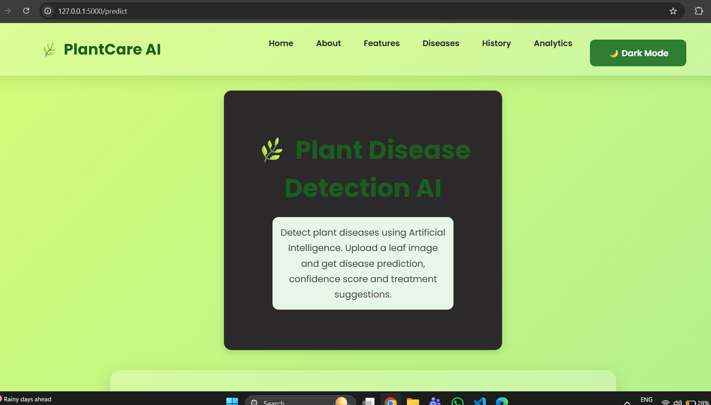
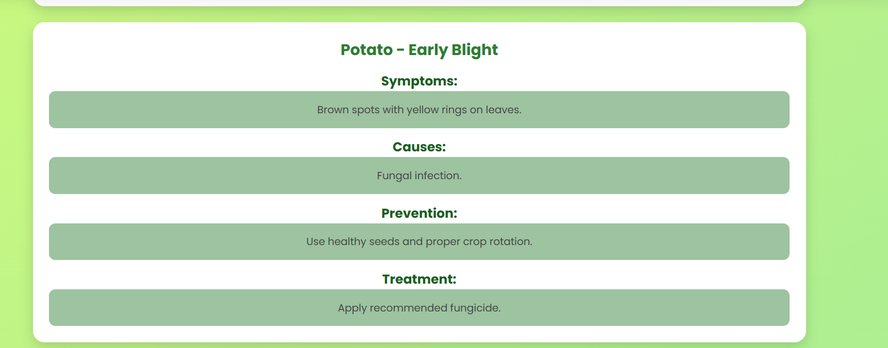

# 🌿 Plant Disease Detection AI

An AI-powered web application that detects plant diseases from leaf images using Deep Learning.


## 🚀 Features

- 🌱 Plant Disease Detection
- 📷 Leaf Image Upload
- 🤖 CNN-based Deep Learning Model
- 📊 Prediction Confidence Score
- 💊 Treatment Recommendations
- 🔍 Symptoms and Prevention Tips
- 📋 Prediction History
- 📈 Analytics Dashboard
- 📄 PDF Report Generation
- 🌙 Dark Mode

## 🛠 Technologies Used

- Python
- Flask
- TensorFlow
- Keras
- HTML
- CSS
- JavaScript
- SQLite

## 📂 Project Structure

```text
Plant-Disease-Detection-AI/
│── app.py
│── database.py
│── pdf_report.py
│── requirements.txt
│── README.md
│
├── models/
├── templates/
├── static/
```

## ⚙️ Installation

```bash
git clone https://github.com/YOUR_USERNAME/Plant-Disease-Detection-AI.git

cd Plant-Disease-Detection-AI

pip install -r requirements.txt

python app.py
```

Open:

```
http://127.0.0.1:5000
```

## 📷 Screenshots

(Add screenshots here after uploading them.)

## 👩‍💻 Developed By

Priyal Jain

## 📸 Project Screenshots

### 🏠 Home Page



---

### 🤖 Prediction Result


---

### 🌱 Disease Information



---

### 📋 Prediction History


---

### 📊 Analytics Dashboard


## 👩‍💻 Author

**Priyal Jain**

GitHub: https://github.com/pj69762-blip